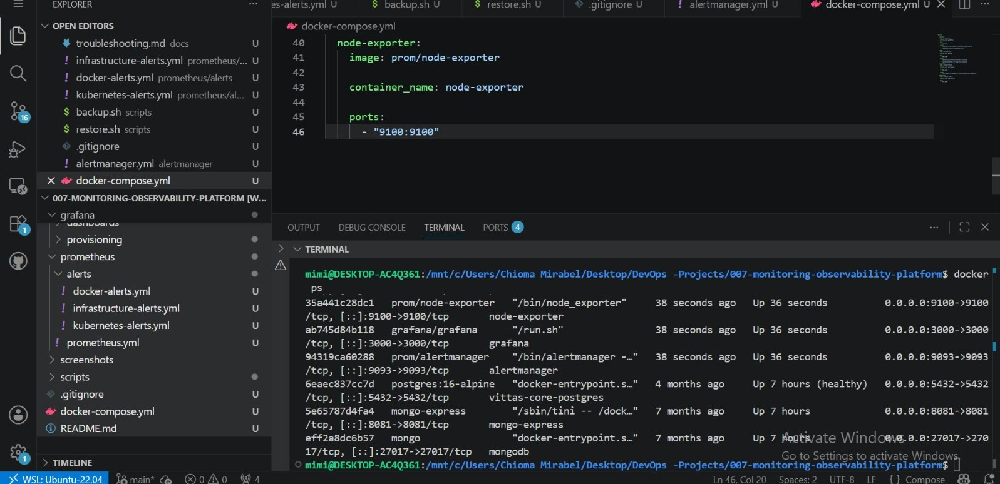
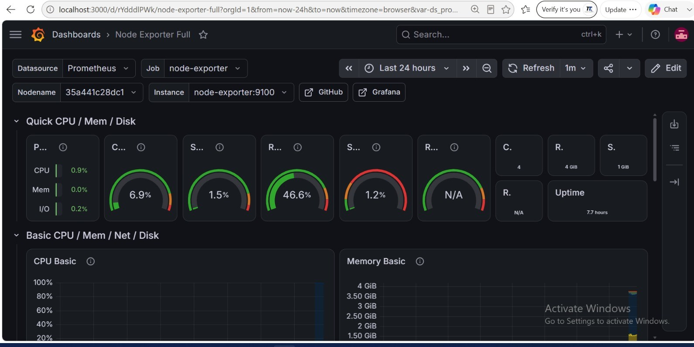
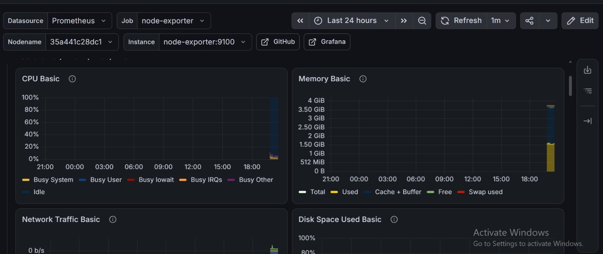
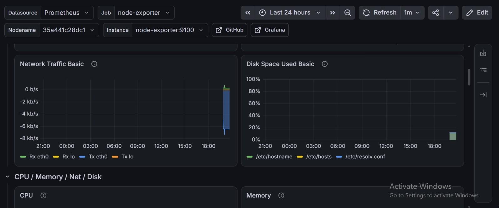
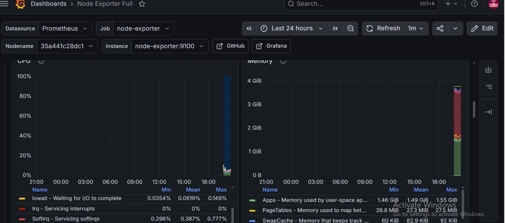
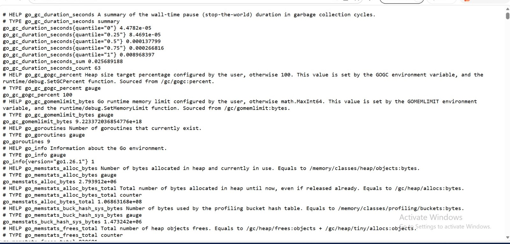

# Monitoring & Observability Platform

## Overview

A production-grade monitoring and observability platform built using Prometheus, Grafana, AlertManager, Docker, and Node Exporter.

The platform provides real-time infrastructure monitoring, alerting, and visualization of system performance metrics including CPU, memory, disk, and network utilization.

## Architecture

Node Exporter → Prometheus → AlertManager → Grafana

## Technologies Used

* Prometheus
* Grafana
* AlertManager
* Docker & Docker Compose
* Node Exporter
* Linux

## Key Features

* Infrastructure Monitoring
* Metrics Collection
* Real-Time Dashboarding
* Alert Management
* Incident Detection
* Containerized Deployment

## Monitored Metrics

* CPU Utilization
* Memory Utilization
* Disk Usage
* Network Traffic
* Service Availability

## Project Structure

```text
.
├── alertmanager/
├── docs/
├── grafana/
├── prometheus/
├── screenshots/
├── scripts/
├── docker-compose.yml
└── README.md
```

## Screenshots

### Running Containers



### Prometheus Targets


### Grafana Datasource


### Dashboard View 1



### Dashboard View 2



### Dashboard View 3



### Dashboard View 4



### Metrics Dashboard



## Deployment

Clone the repository:

```bash
git clone https://github.com/Chioma-Mirabel88/007-monitoring-observability-platform.git
```

Start the monitoring stack:

```bash
docker compose up -d
```

Access services:

* Grafana: http://localhost:3000
* Prometheus: http://localhost:9090
* AlertManager: http://localhost:9093

## Status

Completed

## Future Enhancements

* Slack Alerting
* Microsoft Teams Alerting
* Docker Monitoring with cAdvisor
* Website Monitoring with Blackbox Exporter
* Kubernetes Monitoring
* Automated Backup & Restore
* Infrastructure as Code (Terraform)
* Dashboard Provisioning as Code
